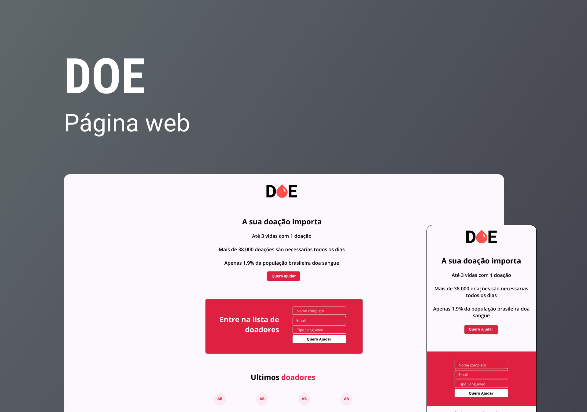

<h1 align="center"> DOE </h1>

  

 

  

## 🚀 Tecnologias

Esse projeto foi desenvolvido com as seguintes tecnologias:

- HTML e CSS
- Git e Github
- Figma

## 💻 Projeto

O DOE é um formulario de doação.

- [Acesse o projeto finalizado, online](https://lkaua22k.github.io/DOE/)

## 📝 Licença

Esse projeto está sob a licença MIT.

---

Feito com ♥ by Kauã :wave:
